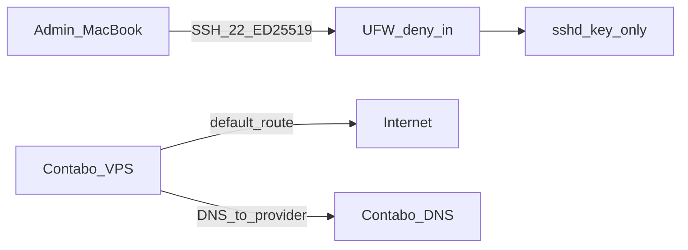
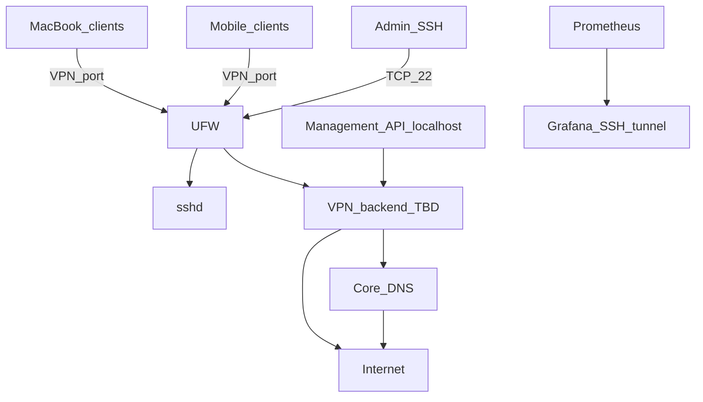

# NETWORK

Living network map. Update when ports or services change.

**Last updated:** 2026-07-09 (Stage 3.5)

## Current (Stage 1)

### Interfaces

- `lo`: 127.0.0.1/8, ::1/128
- `eth0`: 173.249.39.129/24, 2a02:c207:2341:3547::1/64

### Public exposure

- TCP/22 SSH only (UFW allow; PasswordAuthentication no)

### Not yet present

- VPN tunnel interface
- Project DNS (Unbound/CoreDNS)
- Prometheus/Grafana on 127.0.0.1 (Stage 2) — access via SSH tunnel
- Management API (planned localhost / unix socket)

## Target architecture (after Stage 6+)

## Port policy

| Stage | Port | Proto | Source | Service |
|-------|------|-------|--------|---------|
| 1 (now) | 22 | tcp | any (tighten later) | sshd + UFW default deny |
| 2 (now) | 9100/9090/3000 | tcp | localhost only | node_exporter / Prometheus / Grafana |
| 4 | — | — | localhost / VPN subnet | Core DNS |
| 6 | TBD | TBD | any or restricted | VPN backend (ADR-0007) |
| 7 | — | — | localhost | Management API |

## Notes

- IPv6 is enabled end-to-end on the host; leak policy will be defined with VPN + Core DNS.
- ip_forward remains 0 until VPN NAT requires it (Stage 6, with confirm).

## Reputation

See `docs/REPUTATION.md` and ADR-0009 (domain/TLS deferred).
